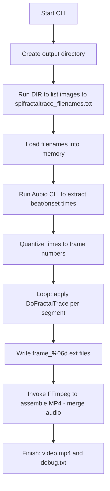

## 1.3 Quickstart: Minimal Command-Line to Generate Frames and MP4

This quickstart shows how to invoke the console application with the minimal set of command-line arguments to:

- Enumerate an input image folder
- Analyze an audio file for beat/onset times via the Aubio CLI
- Apply the fractal-trace transform to each segment
- Wrap the generated frames into an MP4 video with FFmpeg (optionally merging the original audio)

By following these steps you’ll have a folder of numbered frame images and a final MP4 in under a minute.

### Prerequisites

- Build the project in **Release x64** using Visual Studio 2017.
- Ensure the Aubio CLI (`aubiotrack`, `aubionotes`, `aubioonset`, etc.) is installed and on your PATH (or provide its full path).
- Ensure FFmpeg (`ffmpeg.exe`) is installed and on your PATH (or provide its full path).
- Prepare:
- An **input image folder** containing uniformly sized `.jpg`, `.png`, etc.
- An **audio file** (`.wav`, `.mp3`, etc.)

### Command-Line Invocation

From the folder containing the built executable (`spifractaltraceanimaudiobnopcrossfade.exe`), run:

```cmd
spifractaltraceanimaudiobnopcrossfade.exe ^
  "C:\path\to\images"    ^  -- input image folder
  .jpg                   ^  -- file extension
  -1                     ^  -- load all images
  0                      ^  -- wrap outside type
  0                      ^  -- Mandelbrot fractal type
  3                      ^  -- iteration depth
  2.0 0.0 0.0 -1.0 1.0 -1.0 1.0  ^  -- JX, JY, Xmin, Xmax, Ymin, Ymax
  "C:\path\to\audio.mp3" ^  -- audio file
  -1                     ^  -- generate frames for full audio
  1.0                    ^  -- window translation multiple
  30                     ^  -- output video FPS
  "C:\tools\ffmpeg\ffmpeg.exe"
```

All other parameters (frame-filename prefix, video-filename extension, Aubio paths, merge flag, ImageMagick crossfade path, etc.) will default to their built-in values.

### Under-the-Hood Execution Flow



1. The application creates `global_outputimagefolder` if it does not exist (fileciteturn0file0).
2. It runs

```plaintext
   DIR "C:\path\to\images\*.jpg" /B /S /O:N > spifractaltrace_filenames.txt
```

to enumerate all input files (fileciteturn0file0).

1. It calls the Aubio CLI (`global_aubiotrackpath`) to write beat times to `aubiotrack_beattimes.txt` (fileciteturn0file0), then loads and quantizes them to frame indices.
2. It applies `DoFractalTrace` on each frame segment and writes `frame_000001.jpg`, `frame_000002.jpg`, … into the output folder.
3. Finally it constructs and runs an FFmpeg command:

```plaintext
   ffmpeg.exe -i audiofile -r 30 -s 1920x1080 -start_number 1 -i frame_%06d.jpg -vcodec libx264 -crf 25 -pix_fmt yuv420p output.mp4
```

or, if merging audio:

```plaintext
   ffmpeg.exe -i audiofile -r 30 -s 1920x1080 -start_number 1 -i frame_%06d.jpg -vcodec libx264 -crf 25 -pix_fmt yuv420p output(with-audio).mp4
```

(fileciteturn0file3)

### Post-Run Verification

After the run completes, verify:

- **spifractaltrace_filenames.txt** exists and lists all your source images.
- **aubiotrack_beattimes.txt** (and/or onset/note/pitch files) exist with one timestamp per line.
- **debug.txt** contains the execution log and parameter dump.
- The output folder contains `frame_000001.jpg`, `frame_000002.jpg`, … up to the last segment frame.
- The final MP4 file (`*.mp4` or `*with-audio.mp4`) plays back with synchronized audio and fractal transitions.