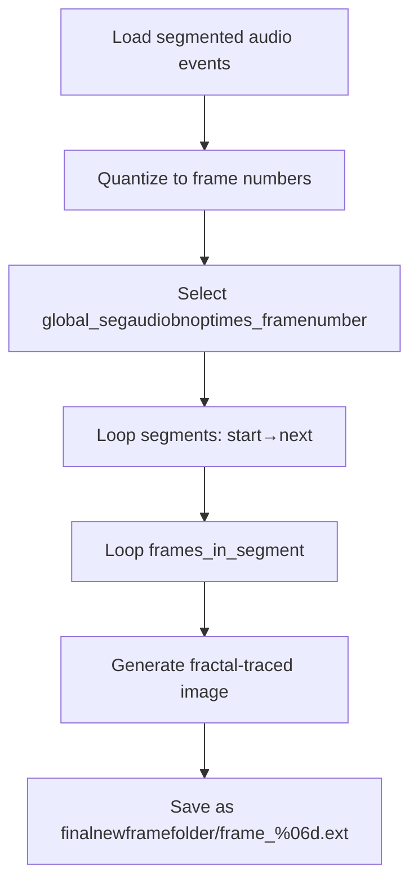

## 2. Core Usage Workflow

### 2.2 Frame Generation Pipeline (Event Segments → Frame Ranges → Output Naming)

This pipeline converts audio-driven event timestamps into frame ranges, then generates and names each output image frame in sequence.

#### 2.2.1 Audio Event Segmentation & Quantization to Frame Numbers

1. **Load raw event times** (beats, notes, onsets, pitches) into

`global_audioXtimes_sec` vectors via Aubio/CLI and file I/O.

1. **Segment events** by filtering out events closer than the configured minimum interval (e.g., `global_aubioonsetminimumonsetinterval_sec`).
2. **Quantize** each retained event time to a frame number using the video FPS (`global_outputvideoframepersecond`):

```cpp
   int framenumber = floor((event_time_sec * global_outputvideoframepersecond) + 0.5);
   if(framenumber == 0 || framenumber == 1 || framenumber == prev_framenumber)
       continue;
   global_segaudioXtimes_framenumber.push_back(framenumber);
   prev_framenumber = framenumber;
```

1. **Select** the appropriate quantized vector based on `global_bnop` (“beat”, “note”, “onset”, or “pitch”):

```cpp
   if(global_bnop=="onset")
       global_segaudiobnoptimes_framenumber = global_segaudioonsettimes_framenumber;
```

#### 2.2.2 Mapping Segments to Frame Ranges

- Initialize the start of the first segment at frame 1:

```cpp
  int framenumber_start = 1;
```

- Iterate through each segment boundary in `global_segaudiobnoptimes_framenumber`:

```cpp
  for(auto iter = global_segaudiobnoptimes_framenumber.begin(); 
      iter != global_segaudiobnoptimes_framenumber.end(); ++iter)
  {
      int framenumber_next = *iter;
      int frames_in_segment = framenumber_next - framenumber_start;

      // Optional: cross-fade logic here...

      // Generate each frame in this segment:
      for(int i = 0; i < frames_in_segment; ++i)
      {
          int framenumber_absolute = framenumber_start + i;
          // … build filename and save …
      }

      framenumber_start = framenumber_next;
  }
```

#### 2.2.3 Output Folder & Filename Pattern

1. **Global settings** (defaults in `spifractaltrace.cpp`):

```cpp
   string global_framefilenameprefix = "frame_";
   string global_imageextension     = ".jpg";      // or other image format
```

1. **Per-audio-file folder**:

```cpp
   string finalnewframefolder = global_outputimagefolder + "\\" + newframefolder;
   _mkdir(finalnewframefolder.c_str());
```

1. **Per-frame filename** uses zero-padded six-digit indices:

```cpp
   char buf[16];
   sprintf(buf, "%06d", framenumber_absolute);
   string filename = finalnewframefolder + "\\" 
                   + global_framefilenameprefix 
                   + buf 
                   + global_imageextension;
   FreeImage_Save(FIF_JPEG, pNew24bitDIB, filename.c_str());
```

This produces names like

`…\output\frame_000001.jpg`, `…\output\frame_000002.jpg`, …



> **Note**: When cross-fading, ImageMagick writes temporary frames using the same `%06d` pattern into `global_outputimagefolder`, then renames them into the final folder with the target frame numbers.

This completes the mapping from audio-driven events to a numbered sequence of output images, ready for optional cross-fade processing and final video assembly.