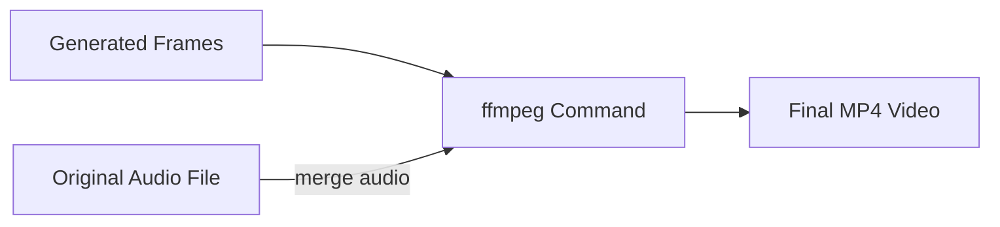

## 2.3 Exporting to MP4 with ffmpeg (With/Without Audio Merge)

Once all frames for a segment have been generated (and optionally cross-faded), the application wraps them into a final MP4 video using an external `ffmpeg` invocation. This step uses the global settings defined in **spifractaltrace.cpp** to construct and execute the appropriate command line, either merging the original audio track or producing silent video.

### 2.3.1 Relevant Global Settings

The following globals control the ffmpeg step (defined in **spifractaltrace.cpp**):

- `global_ffmpegpath` (string): full path to the ffmpeg executable
- `global_framefilenameprefix` (string): frame filename prefix, e.g. `"frame_"`
- `global_framefilenameext` (string): frame filename extension, usually `".jpg"` or `".png"`
- `global_videofilenameext` (string): output video extension, default `".mp4"`
- `global_outputvideoframepersecond` (int): target frame rate, clamped to [1,60]
- `global_audiofilename` (string): path to the original audio file to merge
- `global_mergeaudiowithfinalvideo` (int): `1` to include audio, `0` for silent video

### 2.3.2 Building the ffmpeg Command

In each of the animation drivers (e.g. `spifractaltraceanimaudiobnopcrossfade_moving-frames.cpp`), after frame loops complete, the code does the following ([…] indicates omitted setup code):

```cpp
char bufferfps[64];
int integerfps = (int)global_outputvideoframepersecond;
if (integerfps < 1) integerfps = 1;
if (integerfps > 60) integerfps = 60;
sprintf(bufferfps, "%d", integerfps);

char bufferscale[64];
sprintf(bufferscale, "%dx%d", 1920, 1080);

string systemcommand;
string quote = "\"";

if (global_mergeaudiowithfinalvideo)
{
    string finalvideofilename = finalnewframefolder + "(with-audio)" + global_videofilenameext;

    systemcommand =
        global_ffmpegpath + " -i " + quote + global_audiofilename + quote +
        " -r " + bufferfps +
        " -s " + bufferscale +
        " -start_number 1 -i " + finalnewframefolder + "\\" +
            global_framefilenameprefix + "%6d" + global_framefilenameext +
        " -vcodec libx264 -crf 25 -pix_fmt yuv420p " +
        finalvideofilename;
}
else
{
    string finalvideofilename = finalnewframefolder + global_videofilenameext;

    systemcommand =
        global_ffmpegpath +
        " -r " + bufferfps +
        " -s " + bufferscale +
        " -start_number 1 -i " + finalnewframefolder + "\\" +
            global_framefilenameprefix + "%6d" + global_framefilenameext +
        " -vcodec libx264 -crf 25 -pix_fmt yuv420p " +
        finalvideofilename;
}

// echo and execute
cout << systemcommand << endl;
system(systemcommand.c_str());
```

Key elements of the command:

- `-i "<audiofile>"` (only when `global_mergeaudiowithfinalvideo == 1`)
- `-r <fps>` sets the frame rate
- `-s <width>x<height>` sets the output resolution (hard-coded to 1920×1080)
- `-start_number 1 -i <frames_pattern>` reads frames named `frame_000001.ext`, `frame_000002.ext`, …
- `-vcodec libx264 -crf 25 -pix_fmt yuv420p` uses H.264 encoding with moderate quality
- Output file is placed in the frames folder, suffixed with `.mp4` (and “(with-audio)” if audio was merged)

### 2.3.3 Input Pattern and Naming

The `%6d` pattern in:

```text
<frame_folder>\frame_%6d.jpg
```

expands to six-digit, zero-padded frame numbers, e.g.:

```text
frame_000001.jpg
frame_000002.jpg
…
frame_001234.jpg
```

These values are driven by `global_framefilenameprefix` and `global_framefilenameext` .

### 2.3.4 Example Commands

Silent video (no audio):

```bash
"D:\spibin\ffmpeg\ffmpeg" -r 30 -s 1920x1080 -start_number 1 -i C:\temp\frames\frame_%6d.jpg -vcodec libx264 -crf 25 -pix_fmt yuv420p C:\temp\frames\output.mp4
```

Video with audio merged:

```bash
"D:\spibin\ffmpeg\ffmpeg" -i "C:\temp\audio.wav" -r 30 -s 1920x1080 -start_number 1 -i C:\temp\frames\frame_%6d.jpg -vcodec libx264 -crf 25 -pix_fmt yuv420p C:\temp\frames(with-audio).mp4
```

### 2.3.5 Workflow Diagram



This step completes the Core Usage Workflow, producing an MP4 video ready for review or further processing.