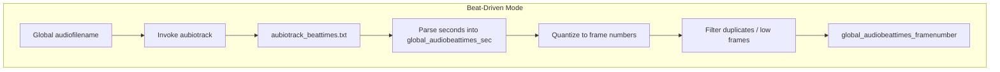

# 3 Audio-Driven Animation Modes (BNOP)

## 3.1 Beat-Driven Mode

### Overview

In Beat-Driven Mode, the fractal-trace animation advances on detected musical beats. The application invokes the aubio **aubiotrack** command-line tool to extract beat times from the input audio file. These times (in seconds) are read back into the program, then converted (“quantized”) into frame indices based on the configured output frame rate. Consecutive or spurious frames (at indices 0,1 or duplicates) are filtered out to produce a clean sequence of beat-aligned frame breakpoints.

### Architecture Overview



### Component Structure

#### Invocation of aubiotrack

The application constructs and executes a shell command that runs aubio’s beat tracker on the specified audio file and redirects its output to `aubiotrack_beattimes.txt`:

```cpp
string quote = "\"";
string systemcommand =
    global_aubiotrackpath + " "
  + quote + global_audiofilename + quote
  + " > aubiotrack_beattimes.txt";
system(systemcommand.c_str());
```

This block resides in the beat-population section of **spifractaltraceanimaudiobnopcrossfade_still-frames.cpp** .

#### Parsing Beat Times

Once `aubiotrack_beattimes.txt` exists, each line (a floating-point timestamp in seconds) is read and stored:

```cpp
ifstream ifs("aubiotrack_beattimes.txt");
string temp;
while (getline(ifs, temp)) {
    global_audiobeattimes_sec.push_back(atof(temp.c_str()));
}
```

This populates `global_audiobeattimes_sec` with raw beat times .

#### Quantization to Frame Numbers

Each beat time is converted to the nearest frame index using the formula `floor(time_sec * fps + 0.5)`:

```cpp
int prev_framenumber = -1;
for (auto iter = global_audiobeattimes_sec.begin(); 
     iter != global_audiobeattimes_sec.end(); ++iter)
{
    int framenumber = floor((*iter * global_outputvideoframepersecond) + 0.5);
    if (framenumber == 0
     || framenumber == 1
     || framenumber == prev_framenumber)
        continue;
    global_audiobeattimes_framenumber.push_back(framenumber);
    prev_framenumber = framenumber;
}
// Optionally add the final frame if not already included
if (prev_framenumber < global_audiofileduration_framenumber)
    global_audiobeattimes_framenumber.push_back(global_audiofileduration_framenumber);
```

This ensures that only meaningful frame breakpoints (excluding frame 0,1 or repeats) are kept and that the very last frame is included .

#### Integration with BNOP Selection

In the main sequencing logic, when the user selects BNOP mode `"beat"`, the pre-quantized beat frame indices drive the animation segments:

```cpp
if (global_bnop == "beat") {
    global_segaudiobnoptimes_framenumber = global_audiobeattimes_framenumber;
}
```

This assignment occurs in **spifractaltraceanimaudiobnopcrossfade_moving-frames.cpp** during BNOP selection .

### Configuration Variables

| Variable | Type | Description |
| --- | --- | --- |
| global_audiofilename | string | Path to the input audio file |
| global_aubiotrackpath | string | Full path to the `aubiotrack` executable |
| global_outputvideoframepersecond | int | Desired output frame rate (frames per sec) |
| global_audiofileduration_framenumber | int | Total audio duration in frames |
| global_audiobeattimes_sec | vector<float> | Detected beat times in seconds |
| global_audiobeattimes_framenumber | vector<int> | Quantized beat times as frame indices |


### Summary

Beat-Driven Mode provides a rhythm-synchronized way to segment the fractal trace animation. By leveraging aubio’s `aubiotrack` utility, it extracts musical beat events, translates them into frame numbers, and filters out redundant or trivial frame breaks. These frame indices then delineate the boundaries of animation segments, ensuring visual changes occur in time with the music.