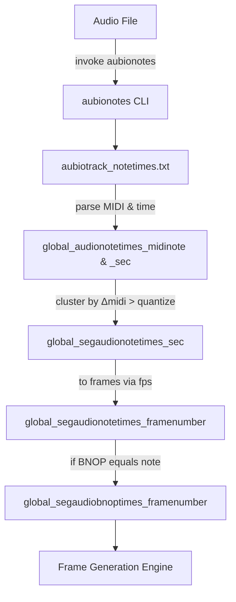

# Note-Driven Mode Feature Documentation

## Overview

Note-Driven Mode enables the application to advance or change its fractal-trace animation frames in response to musical note events extracted from an input audio file. Leveraging the `aubionotes` CLI tool, raw MIDI note numbers and their timestamps are obtained, then clustered (quantized) so that minor pitch fluctuations below a user-specified threshold are ignored. The remaining “significant” note-change events are mapped to video frame indices, driving image transitions at musical note boundaries. This mode adds rhythmic visual dynamism tightly coupled to melodic content.

## Architecture Overview



## Key Configuration Variables

### Global Note-Mode Variables

Defined in `spifractaltraceanimaudiobnopcrossfade_*.cpp`:

| Variable | Type | Description |
| --- | --- | --- |
| global_aubionotespath | string | Filesystem path to the `aubionotes` executable |
| global_aubionotesquantize | int | MIDI quantization threshold: minimum integer difference in MIDI note values to register a new event |
| global_audionotetimes_midinote | vector<float> | Raw MIDI note numbers output by `aubionotes` |
| global_audionotetimes_sec | vector<float> | Raw note timestamps in seconds from `aubionotes` |
| global_segaudionotetimes_sec | vector<float> | Clustered (quantized) note timestamps in seconds |
| global_segaudionotetimes_framenumber | vector<int> | Quantized frame indices corresponding to clustered note times |
| global_segaudiobnoptimes_framenumber | vector<int> | Selected BNOP event frames; in “note” mode this mirrors `global_segaudionotetimes_framenumber` |


## Note Extraction and Quantization Process

### 1. Invoke aubionotes to Produce Raw Note Data

The application constructs and executes a system command using the configured `global_aubionotespath` and the input audio filename, redirecting output to `aubiotrack_notetimes.txt`:

```cpp
systemcommand = global_aubionotespath + " " + quote + global_audiofilename + quote + " > aubiotrack_notetimes.txt";
system(systemcommand.c_str());
```

This writes lines containing three tab-delimited values: `<midi_note>  <time_sec>  <duration_sec>` .

### 2. Parse Raw Note Times

Each line of `aubiotrack_notetimes.txt` is split on `'\t'`. If exactly three tokens are found, the MIDI note and its timestamp are stored:

```cpp
if(itemp==3){
    global_audionotetimes_midinote.push_back(tempfloat[0]);
    global_audionotetimes_sec.push_back(tempfloat[1]);
}
```

Lines with more than three fields trigger an error and exit .

### 3. Cluster (Quantize) Note Events

Minor pitch changes are ignored by comparing each MIDI note against the last accepted note. If the integer difference exceeds `global_aubionotesquantize` (or quantize is 0), the timestamp is retained:

```cpp
float fprev_midinote = 0.0;
for (int i = 0; i < global_audionotetimes_sec.size(); i++) {
    int idiff = (int)fabs(global_audionotetimes_midinote[i] - fprev_midinote);
    if (idiff > global_aubionotesquantize || global_aubionotesquantize == 0) {
        global_segaudionotetimes_sec.push_back(global_audionotetimes_sec[i]);
        fprev_midinote = global_audionotetimes_midinote[i];
    }
}
```

Bounded by the user’s quantization setting, this step produces `global_segaudionotetimes_sec` .

### 4. Convert Segmented Times to Frame Numbers

Each clustered timestamp is multiplied by the global frame rate (`global_outputvideoframepersecond`) and rounded to the nearest frame. Redundant frame indices (0, 1, or repeats) are skipped. Finally, the audio’s last frame is appended:

```cpp
int prev = -1;
for (auto sec : global_segaudionotetimes_sec) {
    int fn = floor(sec * global_outputvideoframepersecond + 0.5);
    if (fn > 1 && fn != prev) {
        global_segaudionotetimes_framenumber.push_back(fn);
        prev = fn;
    }
}
if (prev < global_audiofileduration_framenumber)
    global_segaudionotetimes_framenumber.push_back(global_audiofileduration_framenumber);
```

The result is a strictly increasing sequence of frame numbers at which note changes occur .

## Integration with BNOP Selection

Once all four modes (Beat/Note/Onset/Pitch) have populated their respective segmented frame vectors, the application selects the correct one based on `global_bnop`. In Note-Driven Mode:

```cpp
if (global_bnop == "note") {
    global_segaudiobnoptimes_framenumber = global_segaudionotetimes_framenumber;
}
```

This array (`global_segaudiobnoptimes_framenumber`) is then consumed by the frame-generation loop to trigger image changes at note-defined frames .

## Key Code Locations

- **Variable Definitions & Defaults**

Located near the top of `spifractaltraceanimaudiobnopcrossfade_*.cpp`

Defines `global_aubionotespath`, `global_aubionotesquantize`, and related vectors .

- **aubionotes Invocation & Parsing**

In the audio-analysis section of the same file, immediately after beat extraction

Handles command execution and text-file parsing into raw vectors .

- **Quantization & Frame Conversion**

Follows raw parsing in the audio-analysis block, producing clustered times and final frames .

- **BNOP Mode Selection**

After onset and pitch segmentation, assigns the note-mode frames when `global_bnop == "note"` .

## Dependencies

- **aubionotes CLI**

Must be installed and accessible at the path given by `global_aubionotespath`.

- **libsndfile & aubio**

Required for reading audio metadata and providing the `aubionotes` binary.

- **OpenCV / FreeImage**

Used elsewhere in the project for image loading and fractal operations (not detailed here).

---

This documentation covers the complete flow for Note-Driven Mode, detailing how musical notes are detected, clustered, and mapped to animation frames.