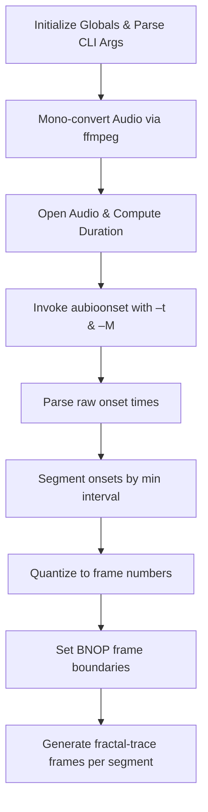

# 3.3 Onset-Driven Mode (aubio aubioonset threshold + minimum interval)

## Overview

Onset-Driven Mode segments the fractal-trace animation based on audio onsets detected by the aubio `aubioonset` command. Each detected onset defines a boundary between animation segments, allowing visual transitions to align precisely with sudden increases in audio energy. By tuning detection sensitivity (threshold) and temporal resolution (minimum interval), users can control how frequently and accurately the animation responds to percussive hits or transient sounds in the input audio.

## Configuration

### Global Variables

The following globals control onset detection and segmentation:

| Variable | Type | Default | Description |
| --- | --- | --- | --- |
| `global_aubioonsetpath` | string | `"D:\\spibin\\aubio\\aubio-0.4.6-win32\\bin\\aubioonset"` | Full path to the `aubioonset` executable. Overridden by CLI argument 32. |
| `global_aubioonsetthreshold` | float | `0.3` | Detection threshold (–t). Lower values yield more onsets; range 0.001–0.900. |
| `global_aubioonsetminimumonsetinterval_sec` | float | `0.020` | Minimum interval between onsets in seconds (–M). Onsets closer than this are merged; defaults to 0.020 s. |
| `global_audioonsettimes_sec` | vector <float> | empty | Raw onset times (seconds) as output by `aubioonset`. |
| `global_segaudioonsettimes_sec` | vector <float> | empty | Filtered onset times after applying minimum-interval segmentation. |
| `global_segaudioonsettimes_framenumber` | vector <int> | empty | Segmented onset times converted to video frame indices. |
| `global_segaudiobnoptimes_framenumber` | vector <int> | empty | When BNOP mode is `"onset"`, this is set equal to `global_segaudioonsettimes_framenumber`. |


All defaults are defined in **spifractaltrace.cpp** and mirrored in both the “moving-frames” and “still-frames” variants .

### CLI Argument Overrides

Users may override these globals via command-line arguments in the following positions (zero-based indexing):

| Arg Index | Global Variable | Validation & Clamping |
| --- | --- | --- |
| 32 | `global_aubioonsetpath` | Any nonempty string. |
| 33 | `global_aubioonsetthreshold` | Parsed as float; clamped to [0.001, 0.900]. If below 0.001 ⇒ 0.001; above 0.900 ⇒ 0.900. |
| 34 | `global_aubioonsetminimumonsetinterval_sec` | Parsed as float; if < 0.0 ⇒ reset to 0.020. |
| 35 | `global_bnop` | Must be one of `"beat"`, `"note"`, `"onset"`, `"pitch"`. If invalid ⇒ `"beat"`. |


The parsing logic appears in **spifractaltraceanimaudiobnopcrossfade_still-frames.cpp** (lines handling `nArgs>32` to `nArgs>35`) .

## Onset Detection Pipeline

### 1. Command Construction

Builds a shell command invoking `aubioonset` with the configured threshold and minimum interval, targeting the (mono-converted) audio file:

```c
char bufferthreshold[256];
sprintf(bufferthreshold, "-t %f", global_aubioonsetthreshold);
char bufferminimuminterval[256];
sprintf(bufferminimuminterval, "-M %f", global_aubioonsetminimumonsetinterval_sec);

string quote = "\"";
string systemcommand = global_aubioonsetpath + " " + bufferthreshold + " "
                     + bufferminimuminterval + " " + quote
                     + global_audiofilename + quote
                     + " > aubiotrack_onsettimes.txt";

system(systemcommand.c_str());
```

This invocation writes raw onset timestamps (seconds) to `aubiotrack_onsettimes.txt` .

### 2. Raw Onset Parsing

Reads each line of `aubiotrack_onsettimes.txt`, converting string to float and appending to `global_audioonsettimes_sec`:

```c
ifstream ifs("aubiotrack_onsettimes.txt");
string temp;
while (getline(ifs, temp)) {
    global_audioonsettimes_sec.push_back(atof(temp.c_str()));
}
```

— Data now represents every detected onset, including very close or spurious ones .

### 3. Minimum-Interval Segmentation

Filters raw onsets to enforce the user-specified minimum interval. Only onsets whose temporal difference from the previous kept onset exceeds `global_aubioonsetminimumonsetinterval_sec` are retained:

```c
myofstream << "segmented audio onset times, begin" << endl;
float fprev_sec = 0.0;
for (float t : global_audioonsettimes_sec) {
    if (fabs(t - fprev_sec) > global_aubioonsetminimumonsetinterval_sec) {
        global_segaudioonsettimes_sec.push_back(t);
        myofstream << t << endl;
        fprev_sec = t;
    }
}
myofstream << "segmented audio onset times, end" << endl;
```

This step eliminates rapid-fire successive onsets closer than the minimum interval .

### 4. Frame Quantization

Converts each segmented onset time (seconds) into a corresponding video frame index using the global frame rate (`global_outputvideoframepersecond`). It also removes duplicates and ensures the very last frame of the audio file is included:

```c
int prev_framenumber = -1;
for (float t : global_segaudioonsettimes_sec) {
    int framenumber = floor((t * global_outputvideoframepersecond) + 0.5);
    if (framenumber <= 1 || framenumber == prev_framenumber)
        continue;
    global_segaudioonsettimes_framenumber.push_back(framenumber);
    prev_framenumber = framenumber;
}
if (prev_framenumber < global_audiofileduration_framenumber)
    global_segaudioonsettimes_framenumber.push_back(global_audiofileduration_framenumber);
```

Resulting `global_segaudioonsettimes_framenumber` is later used as segment boundaries .

### 5. BNOP Mode Selection

When the user’s BNOP mode is set to `"onset"`, the engine assigns:

```c
if (global_bnop == "onset") {
    global_segaudiobnoptimes_framenumber = global_segaudioonsettimes_framenumber;
}
```

Subsequent frame generation loops iterate over `global_segaudiobnoptimes_framenumber` to determine where each fractal-trace segment begins and ends .

## Process Flow



## How Onset Events Drive Animation

1. **Segment Boundaries:** Each frame boundary in `global_segaudiobnoptimes_framenumber` defines the length of one fractal-trace segment.
2. **Visual Reset:** At each onset boundary, the transform parameters (zoom window, translation, etc.) are reset or randomized, creating a visual “jump” in sync with audio transients.
3. **Frame Looping:** Within each segment, frames are interpolated across the fractal space until the next onset, ensuring animation pacing follows the music’s rhythmic structure.

By adjusting `global_aubioonsetthreshold` and `global_aubioonsetminimumonsetinterval_sec`, users tailor sensitivity to achieve anything from rapid strobe-like visuals to more subdued, widely spaced transitions.