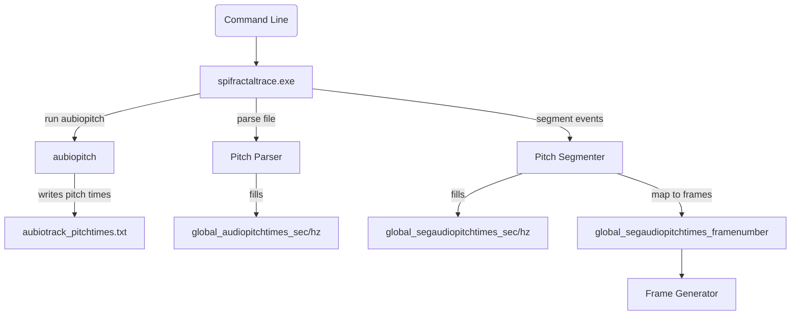
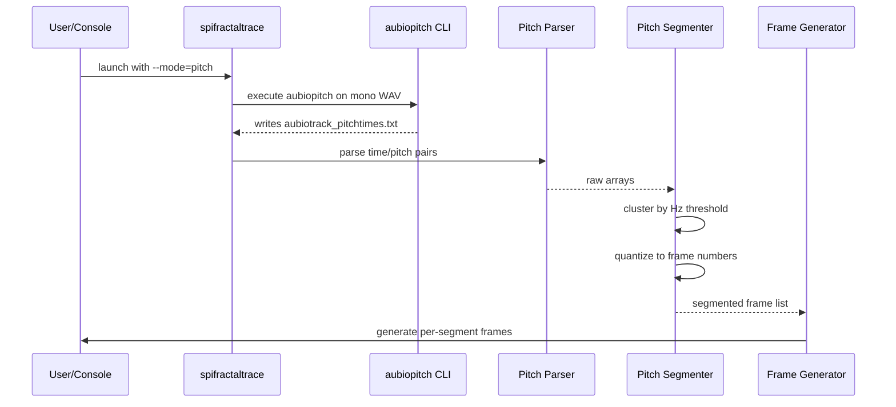

# 3.4 Pitch-Driven Mode (aubio aubiopitch + Hz Quantization/Clustering)

## Overview

The Pitch-Driven Mode analyzes the continuous fundamental frequency (pitch) of the input audio via the aubio CLI tool `aubiopitch`. It extracts a time-series of pitch events (in Hz), then groups (“clusters”) nearby events whose variation falls below a user-configurable threshold (`global_aubiopitchquantize_hz`). Each cluster boundary defines a segment for which the fractal trace animation parameters are held constant. Finally, segment start times (in seconds) are mapped to output frame numbers, producing the list of frame indices at which to switch or update images in the animation.

This mode allows smooth morphing of visuals in response to melodic contours rather than discrete beats or onsets, giving the resulting video a continuous, musical‐pitch-synchronous flow.

## Architecture Overview



## Component Structure

### Extracting Audio Pitch Events

#### **Pitch Extraction**

*spifractaltrace.cpp*

- **Purpose**: Invoke the external `aubiopitch` tool on the (mono) audio file to generate a list of time-stamp/pitch pairs.
- **Key Steps**:
- Build command:

```cpp
     systemcommand = global_aubiopitchpath + " \"" + mono_audiofilename + "\" > aubiotrack_pitchtimes.txt";
     system(systemcommand.c_str());
```

1. Read `aubiotrack_pitchtimes.txt` line by line.
2. Parse each line into time (sec) and pitch (Hz), storing into:
3. `global_audiopitchtimes_sec`
4. `global_audiopitchtimes_hz`

### Parsing Pitch Times

#### **Pitch Parser**

*spifractaltrace.cpp*

- **Purpose**: Convert each line of the `aubiotrack_pitchtimes.txt` into numeric arrays.
- **Key Variables**:

| Name | Type | Description |
| --- | --- | --- |
| `global_audiopitchtimes_sec` | vector<float> | Timestamps (seconds) of each detected pitch frame |
| `global_audiopitchtimes_hz` | vector<float> | Corresponding pitch values (Hz) for each timestamp |


- **Parsing Logic**:

```cpp
  while (getline(ifs, temp)) {
    stringstream ss(temp);
    float t, hz;
    ss >> t >> hz;
    global_audiopitchtimes_sec.push_back(t);
    global_audiopitchtimes_hz.push_back(hz);
  }
```

### Clustering Pitch Events

#### **Pitch Segmenter**

*spifractaltraceanimaudiobnopcrossfade_moving-frames.cpp*

- **Purpose**: Collapse consecutive pitch values that change by less than the quantization threshold into single “events,” producing segment boundaries synchronous to significant pitch shifts.
- **Key Globals**:

| Name | Type | Description |
| --- | --- | --- |
| `global_aubiopitchquantize_hz` | float | Pitch-variation threshold (Hz). Changes smaller than this are ignored for segmentation (0 = no quantizing). |
| `global_segaudiopitchtimes_sec` | vector<float> | Filtered timestamps marking each clustered pitch change start. |
| `global_segaudiopitchtimes_hz` | vector<float> | Representative pitch (Hz) for each clustered event. |
| `global_segaudiopitchtimes_framenumber` | vector<int> | Frame indices corresponding to each clustered timestamp. |


- **Segmentation Algorithm**:

```cpp
  float fprev = 0.0f;
  for (size_t i = 0; i < global_audiopitchtimes_sec.size(); ++i) {
    float diff = fabs(global_audiopitchtimes_hz[i] - fprev);
    if (diff > global_aubiopitchquantize_hz || global_aubiopitchquantize_hz == 0.0f) {
      global_segaudiopitchtimes_sec.push_back(global_audiopitchtimes_sec[i]);
      global_segaudiopitchtimes_hz.push_back(global_audiopitchtimes_hz[i]);
      fprev = global_audiopitchtimes_hz[i];
    }
  }
```

- **Frame Number Quantization**:

```cpp
  int prev_frame = -1;
  for (float t_sec : global_segaudiopitchtimes_sec) {
    int fn = int(floor(t_sec * global_outputvideoframepersecond + 0.5f));
    if (fn > 1 && fn != prev_frame) {
      global_segaudiopitchtimes_framenumber.push_back(fn);
      prev_frame = fn;
    }
  }
  // Ensure last frame of audio is included
  if (prev_frame < global_audiofileduration_framenumber)
    global_segaudiopitchtimes_framenumber.push_back(global_audiofileduration_framenumber);
```

## Feature Flows

### Pitch-Driven Frame Boundary Generation



## Integration Points

- **aubio CLI** (`aubiopitch`): external dependency, invoked via `system()` call.
- **libsndfile** (`sf_open`, `sf_close`): for audio file reading.
- **FreeImage**: for image loading/manipulation.
- **ffmpeg**: invoked earlier to convert arbitrary audio to mono WAV.

## Key Modules Reference

| Module | Responsibility |
| --- | --- |
| `spifractaltrace.cpp` | Main application: audio conversion, CLI invocation, parsing raw pitch data |
| `spifractaltraceanimaudiobnopcrossfade_moving-frames.cpp` | Applies pitch-driven segmentation and quantizes segment start times into video frame indices |


## Dependencies

- aubio 0.4.6 (Windows CLI tools: `aubiopitch`)
- libsndfile (via `SNDFILE*`, `SF_INFO`)
- FreeImage (image I/O)
- ffmpeg (audio preprocessing)

## Testing Considerations

- Vary `global_aubiopitchquantize_hz` (0, small, large) to verify event clustering behavior.
- Ensure edge cases: no audio file, empty pitch output, constant pitch (no segments).
- Confirm final `global_segaudiopitchtimes_framenumber` covers start (frame >1) and end of audio.