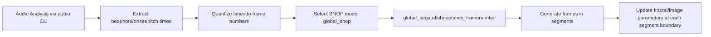

# 3.5 Selecting BNOP Mode and Understanding Segment Timing

This section describes how the `global_bnop` setting selects which audio‐driven timing vector (Beat, Note, Onset, or Pitch) is used to segment the output frame sequence, and how those segment boundaries dictate when fractal‐trace and image parameters may be updated.

---

## BNOP Mode Definition

Four audio‐event streams are analyzed and quantized into frame numbers:

- `global_audiobeattimes_framenumber`
- `global_segaudionotetimes_framenumber`
- `global_segaudioonsettimes_framenumber`
- `global_segaudiopitchtimes_framenumber`

The string

```cpp
string global_bnop = "beat";  // "beat", "note", "onset" or "pitch"
```

defines which of these vectors will drive segmentation. Any unrecognized value defaults to `"beat"` .

```cpp
vector<int> global_segaudiobnoptimes_framenumber;
```

---

## Mapping BNOP to the Segmentation Vector

Once all four streams have been populated and quantized, the code selects the active BNOP vector as follows:

```cpp
if (global_bnop == "beat") {
    global_segaudiobnoptimes_framenumber = global_audiobeattimes_framenumber;
}
else if (global_bnop == "note") {
    global_segaudiobnoptimes_framenumber = global_segaudionotetimes_framenumber;
}
else if (global_bnop == "onset") {
    global_segaudiobnoptimes_framenumber = global_segaudioonsettimes_framenumber;
}
else if (global_bnop == "pitch") {
    global_segaudiobnoptimes_framenumber = global_segaudiopitchtimes_framenumber;
}
```

The resulting `global_segaudiobnoptimes_framenumber` list contains the frame indices at which each BNOP event occurs.

---

## Segment Timing and Parameter Updates

Animation frames are generated in contiguous segments defined by consecutive entries in `global_segaudiobnoptimes_framenumber`. Within each segment, all fractal‐trace parameters (zoom window, translation direction/speed, image‐swap probability, etc.) remain constant, then are recalculated at the start of the next segment:

```cpp
int framenumber_start = 1;
for (auto iter = global_segaudiobnoptimes_framenumber.begin();
     iter != global_segaudiobnoptimes_framenumber.end();
     ++iter)
{
    int framenumber_next = *iter;
    int max_frames_in_segment = framenumber_next - framenumber_start;

    // Loop over frames in this segment...
    // (Apply fractal trace transform with current parameters.)

    framenumber_start = framenumber_next;
}
```

By choosing “beat,” for example, parameters can change only on downbeats; choosing “onset” allows more granular changes at every detected onset, and so on.

---

## Runtime Reporting

Immediately after mapping `global_bnop`, the tool writes out which mode was selected and begins a rhythmic‐statistics report:

```cpp
myofstream << endl << endl << "rhythmic statistics (begin)" << endl;
myofstream << global_bnop << " selected" << endl;
myofstream << "frames\tbeats\tnotes\tonsets\tpitches\tbeats/s\tnotes/s\tonsets/s\tpitches/s" << endl;
```

For example:

```plaintext
beat selected
```

It then iterates over each segment boundary to tally counts and rates of all four event types within each segment, allowing verification of how the chosen BNOP segmentation aligns with the audio rhythm.

---

## BNOP Selection Flowchart



This flowchart illustrates how the choice of BNOP mode determines the temporal segmentation that drives visual parameter changes in the fractal‐trace animation.