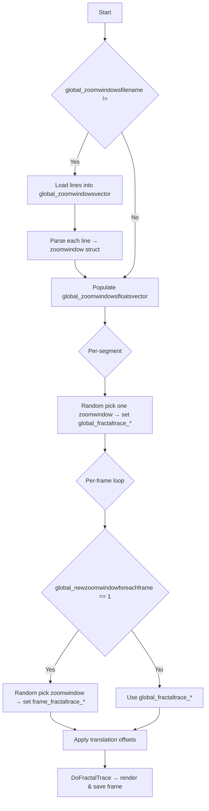

## 5. Image/Fractal Controls (What the Frames Look Like)

### 5.4 Zoom Windows and Per-Frame Window Changes

This section describes how to specify regions of the fractal space (“zoom windows”) via a text file, how those windows are loaded and parsed at startup, and how they are applied either once per audio-driven segment or anew on every frame, under control of the `global_newzoomwindowforeachframe` flag.

#### 5.4.1 Zoom Window File Format

- The zoom windows file is a plain-text file whose path is passed via the `global_zoomwindowsfilename` parameter.
- Each line corresponds to one zoom window, with four floating-point values separated by tabs (`\t`), in the order:
- `xmin`
- `xmax`
- `ymin`
- `ymax`

Example (excerpt from `zoomwindows.txt`):

```plaintext
-0.565563	0.034437	-1.152779	-0.552779
-1.001493	-0.501493	-0.338892	0.161108
```

#### 5.4.2 Data Structures

```cpp
struct zoomwindow {
    float xmin, xmax, ymin, ymax;
};
vector<string> global_zoomwindowsvector;           // Raw lines from the file
vector<zoomwindow> global_zoomwindowsfloatsvector; // Parsed zoom windows
```

- `global_zoomwindowsfilename` (string): Path to the zoom windows text file (default: `""`, meaning no zoom windows).
- `global_newzoomwindowforeachframe` (int):
- `0` (default) — use one zoom window per audio segment.
- `1` — pick a new zoom window for every output frame.

This is set from command-line argument 38 .

#### 5.4.3 Loading and Parsing Zoom Windows

At program start, immediately after loading and quantizing audio events, the code checks for a non-empty filename and loads each line into `global_zoomwindowsvector`:

```cpp
if (global_zoomwindowsfilename != "") {
    ifstream ifs(global_zoomwindowsfilename);
    string temp;
    while (getline(ifs, temp)) {
        global_zoomwindowsvector.push_back(temp);
    }
}
```

If any lines were loaded, each string is tokenized on tabs and converted into a `zoomwindow` struct, which is then appended to `global_zoomwindowsfloatsvector`:

```cpp
if (global_zoomwindowsvector.size() > 0) {
    for (int i = 0; i < global_zoomwindowsvector.size(); i++) {
        stringstream ss(global_zoomwindowsvector[i]);
        string item;
        char delim = '\t';
        float tmp[4] = {
            global_fractaltrace_xmin,
            global_fractaltrace_xmax,
            global_fractaltrace_ymin,
            global_fractaltrace_ymax
        };
        int idx = 0;
        while (getline(ss, item, delim)) {
            if (idx > 3) { /* error handling */ }
            tmp[idx++] = atof(item.c_str());
        }
        zoomwindow wz = { tmp[0], tmp[1], tmp[2], tmp[3] };
        global_zoomwindowsfloatsvector.push_back(wz);
    }
}
```

#### 5.4.4 Applying a Zoom Window per Audio-Driven Segment

When processing each audio segment (e.g., between beats or notes), the program optionally picks one zoom window to apply to all frames in that segment. This occurs before per-frame motion translations and crossfades:

```cpp
if (global_zoomwindowsvector.size() > 0) {
    int idx = RandomInt(0, global_zoomwindowsfloatsvector.size() - 1);
    zoomwindow wz = global_zoomwindowsfloatsvector[idx];
    global_fractaltrace_xmin = wz.xmin;
    global_fractaltrace_xmax = wz.xmax;
    global_fractaltrace_ymin = wz.ymin;
    global_fractaltrace_ymax = wz.ymax;
}
```

All frames generated for that segment use the same `(xmin, xmax, ymin, ymax)` bounds.

#### 5.4.5 Per-Frame Zoom Window Randomization

If `global_newzoomwindowforeachframe` is set to `1`, then **before** each individual frame is drawn, a new zoom window is chosen randomly from `global_zoomwindowsfloatsvector`, overriding both the global fractal bounds and any segment-level selection:

```cpp
if (global_newzoomwindowforeachframe) {
    if (global_zoomwindowsvector.size() > 0) {
        int idx = RandomInt(0, global_zoomwindowsfloatsvector.size() - 1);
        zoomwindow wz = global_zoomwindowsfloatsvector[idx];
        frame_fractaltrace_xmin = wz.xmin;
        frame_fractaltrace_xmax = wz.xmax;
        frame_fractaltrace_ymin = wz.ymin;
        frame_fractaltrace_ymax = wz.ymax;
    }
}
```

This code runs inside the per-frame loop, immediately before computing motion offsets and calling `DoFractalTrace` .

#### 5.4.6 Zoom-Window Application Flow



#### 5.4.7 Summary of Parameters

- **global_zoomwindowsfilename** (string): Path to tab-separated zoom windows file.
- **global_newzoomwindowforeachframe** (int):
- `0` — one window per segment
- `1` — new window each frame
- **global_zoomwindowsvector** (vector\<string\>): Raw file lines.
- **global_zoomwindowsfloatsvector** (vector\<zoomwindow\>): Parsed zoom windows.
- **zoomwindow** struct: Holds `(xmin, xmax, ymin, ymax)`.

By adjusting the zoom windows file and the per-frame flag, users can control whether the fractal view jumps between predefined regions on each beat, on each frame, or remains fixed throughout.