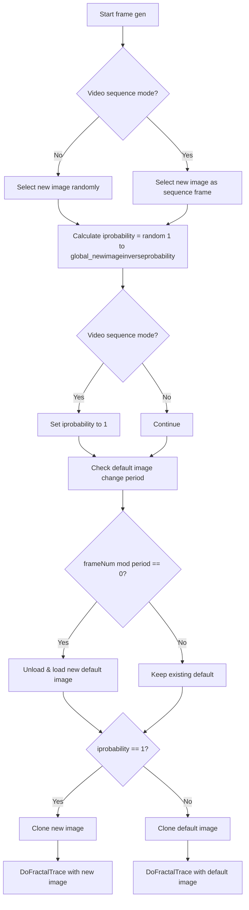

# 5 Image/Fractal Controls (What the Frames Look Like)

## 5.5 Image Selection Strategy (Random vs Sequential Frames, Default Image Changes)

This section describes how, for each output frame, the application chooses which source image to feed into the fractal-trace transform.  Two layers of randomness/intervention are at play:

1. **Which image handle** is used as the “new” image for a segment of frames
2. **Per-frame decision** to use that new image or fall back to a “default” image
3. **Periodic rotation** of the default image

Together these controls drive variability or smooth continuity in the animation.

---

### Global Parameters

| Parameter | Type | Description |
| --- | --- | --- |
| global_newimageinverseprobability | int | Inverse probability (1–100) for selecting a new image on each frame: 1 = always new image, 100 = ~1% chance per frame |
| global_INPUTIMAGES_ARE_VIDEOSEQUENCEFRAMES | int | When 1, treat `global_imagehandles` as a strict frame sequence (no random picks) |
| global_INPUTIMAGES_ARE_TOBEUSEDASSEQUENCEOFFRAMES | int | When 1, treat images as a subsequence of a larger sequence (also sequential) |
| global_defaultimagechangeperiod_sec | float | Default image rotation period in seconds (≤0 disables) |
| global_defaultimagechangeperiod_framenumber | int | Equivalent period in frame count (derived from `global_defaultimagechangeperiod_sec`) |


---

### 5.5.1 Default Random Selection

At the start of each audio-driven segment, the application picks a “new” image at random:

```cpp
int imagehandleindex = RandomInt(0, global_imagehandles.size() - 1);
FIBITMAP* p24bitDIB = global_imagehandles[imagehandleindex];
```

This defines the candidate frame image for that segment .

Each frame then computes a random integer:

```cpp
int iprobability = RandomInt(1, global_newimageinverseprobability);
```

If `iprobability == 1`, that frame uses the “new” image; otherwise it uses the current default image .

### 5.5.2 Sequential Frames Mode

When the mode flags indicate the input folder is already a video sequence,

new images are picked **deterministically** rather than randomly.  Immediately

after the random-pick step, the code overrides both selection and probability:

```cpp
if (global_INPUTIMAGES_ARE_VIDEOSEQUENCEFRAMES ||
    global_INPUTIMAGES_ARE_TOBEUSEDASSEQUENCEOFFRAMES)
{
  // Force new image every frame
  iprobability = 1;

  // Pick the next frame in sequence
  int idx = (framenumber_absolute - 1) % global_imagehandles.size();
  p24bitDIB = global_imagehandles[idx];
}
```

This ensures each frame advances by one index through the loaded images .

### 5.5.3 Periodic Default Image Changes

Separately, the “default” image—used when `iprobability != 1`—can itself

rotate periodically, to avoid stale fallback frames.  At each frame:

```cpp
if (global_defaultimagechangeperiod_sec > 0.0 &&
    global_defaultimagechangeperiod_framenumber > 0 &&
    (framenumber_absolute % global_defaultimagechangeperiod_framenumber) == 0)
{
  // Unload old default
  FreeImage_Unload(p24bitDIBdefault);

  // Pick a new default at random
  int idx = RandomInt(0, global_imagefilenames.size() - 1);
  FIBITMAP* pDIB = FreeImage_Load(FIF_JPEG,
                                  global_imagefilenames[idx].c_str(),
                                  JPEG_DEFAULT);
  p24bitDIBdefault = FreeImage_ConvertTo24Bits(pDIB);
  FreeImage_Unload(pDIB);
}
```

This swap occurs every `global_defaultimagechangeperiod_framenumber` frames .

### 5.5.4 Per-Frame Clone & Fractal Trace

Finally, for each frame:

```cpp
FIBITMAP* pNew24bitDIB;
if (iprobability == 1)
  pNew24bitDIB = FreeImage_Clone(p24bitDIB);        // new image
else
  pNew24bitDIB = FreeImage_Clone(p24bitDIBdefault); // default image

DoFractalTrace(
  (iprobability == 1) ? p24bitDIB : p24bitDIBdefault,
  pNew24bitDIB,
  frame_fractaltrace_xmin, frame_fractaltrace_xmax,
  frame_fractaltrace_ymin, frame_fractaltrace_ymax);
```

Cloning isolates each frame’s bitmap before applying `DoFractalTrace` .

---

### Decision Flowchart



This logic ensures a balance of randomness, sequential progression, and periodic fallback rotation to produce dynamic yet coherent fractal animations.