# 7 Monitoring, Logs, and Output Artifacts

## 7.2 Rhythmic Statistics Report (Beats/s, Notes/s, Onsets/s, Pitches/s)

### Overview

The Rhythmic Statistics Report summarizes, for each audio-driven segment, the raw counts and per-second rates of four event types—beats, notes, onsets, and pitches. This report:

- Breaks the entire audio track into contiguous segments based on the chosen `bnop` mode (beat/note/onset/pitch).
- For each segment, counts how many of each event occurred and computes the corresponding rate (events per second).
- Computes global averages and maxima across all segments.
- Emits a human-readable tabular log that appears between the markers `rhythmic statistics (begin)` and `rhythmic statistics (end)` in **debug.txt** .

This information helps the user understand the temporal density of audio events and fine-tune parameters such as crossfade length or segmentation strategy.

### Data Structures

All rhythmic statistics are stored in the following struct and global containers:

#### struct rhythmicstats

Defined in **spifractaltrace.cpp**:

```cpp
struct rhythmicstats {
    int   beats;         // count of beat events in segment
    int   notes;         // count of note events in segment
    int   onsets;        // count of onset events in segment
    int   pitches;       // count of pitch events in segment
    float beatspersec;   // beats / segment_duration_sec
    float notespersec;   // notes / segment_duration_sec
    float onsetspersec;  // onsets / segment_duration_sec
    float pitchespersec; // pitches / segment_duration_sec
};
```

Global containers and summary variables:

- `vector<rhythmicstats> global_segaudiobnoptimes_rhythmicstats;`
- `float global_avgbeatspersec, global_maxbeatspersec;`
- `float global_avgnotespersec, global_maxnotespersec;`
- `float global_avgonsetspersec, global_maxonsetspersec;`
- `float global_avgpitchespersec, global_maxpitchespersec;`

### Computation Workflow

```mermaid
flowchart LR
    A[Audio Analysis Output<br/>beat/note/onset/pitch times]
    B[Quantize to Frame Numbers]
    C[Select Segment Boundaries<br/>based on global_bnop]
    D[Loop over Segments]
    E[Count Events per Segment]
    F[Compute Rates per Segment]
    G[Accumulate Sums & Maxima]
    H[Store rhythmicstats in Vector]
    I[Log Tabular Report]
    
    A --> B --> C --> D --> E --> F --> G --> H --> I
```



1. **Quantization**

The raw timestamps from Aubio are converted into integer frame numbers at the target frame rate.

1. `**bnop**`** Selection**

Depending on the string `global_bnop` (“beat”, “note”, “onset”, or “pitch”), the corresponding vector of frame-number boundaries is chosen:

```cpp
   if(global_bnop=="beat")
       global_segaudiobnoptimes_framenumber = global_audiobeattimes_framenumber;
   else if(global_bnop=="note")
       global_segaudiobnoptimes_framenumber = global_segaudionotetimes_framenumber;
   else if(global_bnop=="onset")
       global_segaudiobnoptimes_framenumber = global_segaudioonsettimes_framenumber;
   else if(global_bnop=="pitch")
       global_segaudiobnoptimes_framenumber = global_segaudiopitchtimes_framenumber;
```

1. **Segment Loop**
2. Initialize `framenumber_start = 1`.
3. For each boundary `framenumber_next` in `global_segaudiobnoptimes_framenumber`, create a fresh `rhythmicstats` with all counters zeroed.
4. Count how many beat, note, onset, and pitch frame numbers fall in `[framenumber_start, framenumber_next)`.
5. Compute segment duration:

```cpp
     float interval_sec = maxFrames / (float)global_outputvideoframepersecond;
     myrhythmicstats.beatspersec   = myrhythmicstats.beats   / interval_sec;
     myrhythmicstats.notespersec   = myrhythmicstats.notes   / interval_sec;
     myrhythmicstats.onsetspersec  = myrhythmicstats.onsets  / interval_sec;
     myrhythmicstats.pitchespersec = myrhythmicstats.pitches / interval_sec;
```

- Update running sums (`sum1`…`sum4`) and maxima (`global_max…persec`).
- Append `myrhythmicstats` to `global_segaudiobnoptimes_rhythmicstats`.
- Set `framenumber_start = framenumber_next`.
- **Global Summaries**

After the loop, compute averages:

```cpp
   global_avgbeatspersec   = sum1 / numberofbnop;
   global_avgnotespersec   = sum2 / numberofbnop;
   global_avgonsetspersec  = sum3 / numberofbnop;
   global_avgpitchespersec = sum4 / numberofbnop;
```

### Log Output Format

All output is written to **debug.txt** between the markers “rhythmic statistics (begin)” and “rhythmic statistics (end)”:

```plaintext
rhythmic statistics (begin)
<p> selected
frames    beats   notes   onsets   pitches   beats/s   notes/s   onsets/s   pitches/s
[start–end]    b    n    o    p    bps    nps    ops    pps
...
global_avgbeatspersec: <value>, global_maxbeatspersec: <value>
global_avgnotespersec: <value>, global_maxnotespersec: <value>
global_avgonsetspersec: <value>, global_maxonsetspersec: <value>
global_avgpitchespersec: <value>, global_maxpitchespersec: <value>
rhythmic statistics (end)
```

Each row reports one segment’s frame range, raw counts, and rates .

### Reflecting the Chosen `bnop` Mode

- The first line after the “begin” marker echoes the active mode (`beat`, `note`, `onset`, or `pitch`).
- Only the selected event type determines segment boundaries; all four event types are still counted within each segment.
- This makes it easy to compare how, for example, onset-based segmentation differs in event density from beat-based segmentation.

### Output Artifacts

- **debug.txt**: includes the full tabular Rhythmic Statistics Report.
- **In-Memory Data**: `global_segaudiobnoptimes_rhythmicstats` holds per-segment stats for potential downstream uses (e.g., adaptive crossfade durations).
- **Summary Variables**: `global_avg…` and `global_max…` floats can be used to annotate final video or trigger alerts if event densities exceed thresholds.

This detailed report empowers users to validate audio-driven frame segmentation and optimize visual pacing.