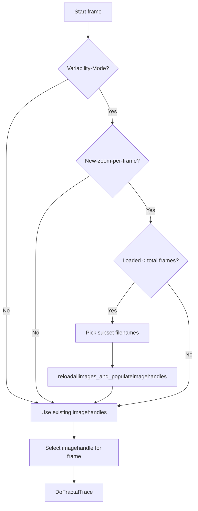

### 8.3 Variability-Matrix and Memory/Performance Considerations

When `global_fractaltrace_outsidetype` is set to `OUTSIDE_TYPE_WRAP_WITHVARIABILITYMATRIX` (value 3), the fractal-trace algorithm no longer samples pixels by wrapping around a single input image. Instead, it maintains a pool of input frames in memory (`global_imagehandles`) and a “variability matrix” (`global_vm`) of index offsets into that pool.  This enables per-pixel variability: when a fractal escape falls outside the current selection, the code picks one of the loaded frames (via the matrix) for bilinear sampling .

#### How It Works

– At startup (or after reloading), `global_imagehandles` is populated with up to `global_maxnumberofimagestoload` frames, each converted to 24-bit DIBs .

– `global_imagehandlesmap` maps each `FIBITMAP*` handle back to its index in the vector, enabling reverse lookup from a DIB pointer .

– `global_vm` is a square 2D array of size `VARIABILITYMATRIXSIZE×VARIABILITYMATRIXSIZE` (9×9 by default).  Each entry is initialized to a random index between 0 and (`global_imagehandles.size()–1`) .

In `DoFractalTrace`, when a sample point `(px, py)` falls outside the source image bounds, the code computes fractional tile coordinates, looks up the matrix entry for that offset, and then samples from `global_imagehandles[ vm_value ]` instead of the original `input_dib` .

#### Image Loading & Indexing

```cpp
// Reloads all images into memory, crops/scales as needed,
// repopulates global_imagehandles and global_imagehandlesmap,
// and re-initializes the variability matrix global_vm[9][9].
int reloadallimages_and_populateimagehandles()
{
    unloadallimages();
    for (auto &filename : global_imagefilenames) {
        FIBITMAP* pDIB = FreeImage_Load(...);
        FIBITMAP* p24 = FreeImage_ConvertTo24Bits(pDIB);
        FreeImage_Unload(pDIB);
        global_imagehandles.push_back(p24);
    }
    global_imagehandlesmap.clear();
    for (int i = 0; i < global_imagehandles.size(); i++)
        global_imagehandlesmap[ global_imagehandles[i] ] = i;

    int maxIndex = global_imagehandles.size() - 1;
    for (int ix = 0; ix < VARIABILITYMATRIXSIZE; ix++)
      for (int iy = 0; iy < VARIABILITYMATRIXSIZE; iy++)
        global_vm[ix][iy] = RandomInt(0, maxIndex);

    return 0;
}
```

This complete reload can be expensive in both CPU and RAM when many images or very large images are involved .

#### Per-Frame Reload Logic

To support high variability without exhausting memory, the code can load only a subset of images and then, on certain beats/segments or every frame, reload a fresh subset:

```cpp
if (global_fractaltrace_outsidetype == OUTSIDE_TYPE_WRAP_WITHVARIABILITYMATRIX
 && global_newzoomwindowforeachframe
 && global_maxnumberofimagestoload > 0
 && global_imagefilenames_backup.size() > global_maxnumberofimagestoload)
{
    picknew_imagefilenamessubset_from_imagefilenamesbackup(global_imagefilenames);
    reloadallimages_and_populateimagehandles();
    randompicknewdefaultimage_and_prepareoutputimagebuffer();
    // pick first image for this frame
    imagehandleindex = RandomInt(0, global_imagehandles.size()-1);
    p24bitDIB = global_imagehandles[imagehandleindex];
}
```

This block runs inside the per-frame loop, causing a full unload/reload and matrix re-initialization whenever high variability is requested and the configured max-images limit is hit .

#### Performance Implications

- **Memory Footprint**: Loading  frames at full resolution (e.g. 1920×1080 or higher) consumes `n×width×height×3 bytes`.  Limiting `global_maxnumberofimagestoload` reduces peak usage.
- **CPU & I/O**: Each reload iterates through all filenames, calls `FreeImage_Load`, `FreeImage_ConvertTo24Bits`, and `FreeImage_Unload`, which may stall frame generation, especially on mechanical disks or with large images.
- **Cache Locality**: High variability means sampling across many frames, reducing cache hits; this can degrade `pixels_get_biliner` performance.
- **Trade-off Tuning**:

– Set `global_maxnumberofimagestoload = -1` to load all images once (highest memory, best per-frame speed).

– Use a smaller positive value to cap memory, accepting occasional reload stalls.

– Disable `global_newzoomwindowforeachframe` to reload only per audio-segment boundary, not every frame.

#### Reload Decision Flow



Keeping these flags and limits in balance is crucial to avoid out-of-memory errors or frame stalls when using the variability-matrix mode.