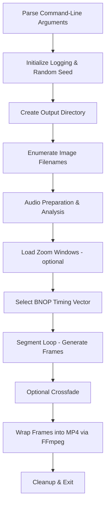

# 9 Internals (For Advanced Users)

## 9.1 End-to-End Program Flow in spifractaltrace.cpp (_tmain Orchestration)

This section walks through the main orchestration in `spifractaltrace.cpp`, starting from program startup (`_tmain`) through to final MP4 creation. The console application applies a fractal-trace transform to a sequence of input images, driving segment boundaries from audio analysis (beat, note, onset or pitch via the aubio CLI), optionally cross-fading adjacent segments, and finally invoking FFmpeg to wrap frames into a video. Advanced users can follow this flow to understand or modify timing, cross-fade parameters, or integration points.

## Architecture Overview



### 9.1.1 Command-Line Argument Parsing

File: **spifractaltrace.cpp**

The program begins by splitting `GetCommandLineA()` and `GetCommandLineW()` into `szArgList`/`szArgListW`, then populates global configuration variables from `argv[1..n]`. Each `if(nArgs>i)` block assigns one of the parameters—such as `global_imagefolder`, `global_fractaltrace_xmin/ymax`, `global_audiofilename`, `global_ffmpegpath`, `global_bnop` (beat/note/onset/pitch), cross-fade and zoom parameters—into its corresponding `global_*` variable .

### 9.1.2 Logging & Random Seed Initialization

Immediately after parsing, the program opens `debug.txt` for detailed logs and writes the executable name. It seeds the C runtime RNG with the current time to drive randomized image selection, translation and zoom behaviors .

### 9.1.3 Output Directory Creation

Before any work, `_mkdir(global_outputimagefolder.c_str())` creates the output folder for all generated frames. No overwrite check is performed here—the user must ensure write permissions and that the directory does not collide with existing data .

### 9.1.4 Image File Enumeration

If `global_imagefolder` and `global_imageextension` are set, the program issues a Windows `DIR` command:

```cpp
systemcommand = "DIR \"" + global_imagefolder + "\\*" + global_imageextension + "\" /B /S /O:N > spifractaltrace_filenames.txt";
system(systemcommand.c_str());
```

It then reads `spifractaltrace_filenames.txt` line by line into `global_imagefilenames` .

### 9.1.5 Audio Preparation & Analysis

1. **Mono WAV Conversion**

If `global_audiofilename` is non-empty, FFmpeg is invoked to convert any input format to a mono WAV:

```cpp
   mono_audiofilename = "mono_audiofilename.wav";
   systemcommand = "\"" + global_ffmpegpath + "\" -y -i \"" + global_audiofilename + "\" -ac 1 " + mono_audiofilename;
   system(systemcommand.c_str());
```

1. **Duration Measurement**

`libsndfile` (`sf_open`) reads `mono_audiofilename` to compute `global_audiofileduration_sec` and its frame-count equivalent. Errors abort the run .

1. **Beat Detection**

The aubio beat tracker (`global_aubiotrackpath`) is run:

```cpp
   systemcommand = global_aubiotrackpath + " \"" + mono_audiofilename + "\" > aubiotrack_beattimes.txt";
   system(systemcommand.c_str());
```

Times in seconds are loaded into `global_audiobeattimes_sec`, then quantized to `global_audiobeattimes_framenumber` by multiplying by `global_outputvideoframepersecond` and rounding .

1. **BNOP Timing Vector Selection**

Based on `global_bnop` (“beat”/“note”/“onset”/“pitch”), the corresponding `global_segaudiobnoptimes_framenumber` vector is chosen for segment boundaries.

### 9.1.6 Zoom Windows Loading (Optional)

If `global_zoomwindowsfilename` is provided, each line (tab-delimited `xmin,xmax,ymin,ymax`) is read into `global_zoomwindowsvector` for per-segment or per-frame random zoom selection .

### 9.1.7 Frame Generation Loop

For each audio file in `global_audiofilenames` (normally one), a subfolder is created under `global_outputimagefolder` named after the audio filename (spaces→underscores, dots→dashes). Then:

1. **Segment Folder Creation**

For each entry in `global_segaudiobnoptimes_framenumber`, compute

- `framenumber_start` (previous boundary + 1)
- `framenumber_next` (current boundary)

A folder named by the segment (including an optional tag of fractal parameters) is `_mkdir`-ed .

1. **Per-Segment Randomization**
2. Pick an image handle index (`global_imagehandles`) at random.
3. Choose one of four translation schemes.
4. If zoom windows are loaded, select one at random and override the fractal trace bounds.
5. Flip between the default image versus a new one based on `global_newimageinverseprobability`.

1. **Frame Rendering**

For each frame index `iframe` in `[0, framenumber_next–framenumber_start)`:

- Compute absolute frame number.
- Invoke `DoFractalTrace(input_dib, output_dib, xmin, xmax, ymin, ymax)`.
- Save `output_dib` to PNG/JPEG via `FreeImage_Save` using a zero-padded filename (`%06d`) .

### 9.1.8 Optional Crossfade

If `global_maxnumberofframeforcrossfades > 2`, adjacent segment boundary frames are cross-faded using ImageMagick’s `convert … -morph N`, inserting the resulting frames into the appropriate segment folder. Each cross-fade invocation is a quoted system call, and frames are renamed/moved into place .

### 9.1.9 Video Assembly (FFmpeg)

Once all frames are generated (and cross-faded if enabled), FFmpeg is invoked:

```cpp
systemcommand = global_ffmpegpath +
  " -r " + bufferfps +
  " -s " + bufferscale +
  " -start_number 1 -i " +
  finalnewframefolder + "\\" +
  global_framefilenameprefix + "%6d" +
  global_framefilenameext +
  " -vcodec libx264 -crf 25 -pix_fmt yuv420p " +
  finalvideofilename;
system(systemcommand.c_str());
```

If `global_mergeaudiowithfinalvideo` is set, the original audio file is merged via FFmpeg’s `-i audiofile … -map` options .

### 9.1.10 Cleanup & Exit

Finally, all in-memory `FIBITMAP*` handles are unloaded via `FreeImage_Unload`, debug streams are closed, and the process returns 0 on success or a non-zero code on any failure (image load error, audio open error, directory creation error, etc.).

---

This end-to-end flow in `_tmain` orchestrates image enumeration (FreeImage), audio analysis (aubio, libsndfile), fractal mapping (`DoFractalTrace`), optional cross-fade (ImageMagick), and video assembly (FFmpeg), all driven by global configuration set from the command line.