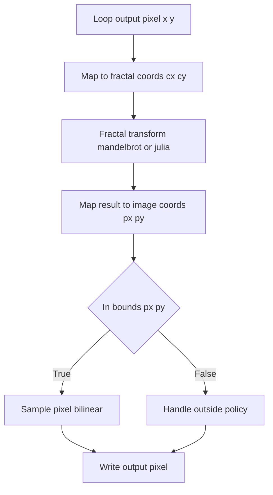

# 9. Internals (For Advanced Users)

## 9.2 Fractal Trace Algorithm Implementation (DoFractalTrace + Mapping Functions)

This section digs into the core of the fractal-trace image mapping: how output pixels are remapped through Mandelbrot/Julia iterations, sampled from source frames via bilinear interpolation, and how out-of-bounds coordinates are handled (wrap, variability matrix, black/white fill).

### 9.2.1 Mapping Functions: mandelbrot and julia

#### mandelbrot

Signature:

```cpp
void mandelbrot(double x, double y, double *u, double *v);
```

- Starts with z = (xx,yy) = (x,y).
- Iterates z ← z² + c (c = original (x,y)) for `global_fractaltrace_depth` steps.
- Does **not** perform bailout checks—always runs full depth.
- Returns the final z components in `*u = xx`, `*v = yy`.

#### julia

Signature:

```cpp
void julia(double x, double y, double jx, double jy, double *u, double *v, double bailout2);
```

- Starts with z = (xx,yy) = (x,y).
- Iterates z ← z² + (jx,jy) up to `global_fractaltrace_depth` steps.
- On each iteration, computes x2 = xx², y2 = yy², then tmp = x2 - y2 + jx; yy = 2·xx·yy + jy; xx = tmp.
- If x2 + y2 exceeds `bailout2` (square of bailout radius), breaks early.
- Returns `*u = xx`, `*v = yy`.

### 9.2.2 DoFractalTrace

#### Signature

```cpp
void DoFractalTrace(
    FIBITMAP* input_dib,
    FIBITMAP* output_dib,
    double fractaltrace_xmin,
    double fractaltrace_xmax,
    double fractaltrace_ymin,
    double fractaltrace_ymax
);
```

#### High-Level Flow



#### Detailed Steps

1. **Compute dimensions**
2. `imagewidth`/`imageheight` from `input_dib`
3. `selectionwidth`/`selectionheight` from `output_dib`
4. `selectionxmin=0`, `selectionxmax=selectionwidth`, similarly for Y.

1. **Precompute scales and bailout**
2. `bailout2 = global_fractaltrace_bailout²`
3. `scale_x = (fractaltrace_xmax - fractaltrace_xmin) / selectionwidth`
4. `scale_y = (fractaltrace_ymax - fractaltrace_ymin) / selectionheight`

1. **Per-pixel mapping**

For each `y` in `[selectionymin,selectionymax)` and each `x` in `[selectionxmin,selectionxmax)`:

a. Compute fractal plane coordinates:

```cpp
   cx = fractaltrace_xmin + (x - selectionxmin) * scale_x;
   cy = fractaltrace_ymin + (y - selectionymin) * scale_y;
```

b. Apply chosen transform:

```cpp
   switch (global_fractaltrace_type) {
     case FRACTALTRACE_TYPE_MANDELBROT:
       mandelbrot(cx, cy, &px, &py);
       break;
     case FRACTALTRACE_TYPE_JULIA:
       julia(cx, cy, global_fractaltrace_jx, global_fractaltrace_jy, &px, &py, bailout2);
       break;
     case FRACTALTRACE_TYPE_JULIA_MANDELBROT:
       julia(cx, cy, cx, cy, &px, &py, bailout2);
       break;
     default:
       mandelbrot(cx, cy, &px, &py);
   }
```

c. Map back to input image pixel coords:

```cpp
   px = (px - fractaltrace_xmin) / scale_x + selectionxmin;
   py = (py - fractaltrace_ymin) / scale_y + selectionymin;
```

1. **Sampling or outside handling**

```cpp
   if (0 <= px && px < imagewidth && 0 <= py && py < imageheight) {
       pixels_get_biliner(input_dib, px, py, &pixel);
   }
   else {
       // see 9.2.3 Outside Coordinate Policies
   }
   pixels_set(output_dib, x, y, &pixel);
```

### 9.2.3 Outside Coordinate Policies

When the mapped `(px,py)` falls outside the source image bounds, `global_fractaltrace_outsidetype` controls the behavior:

| Policy | Value | Behavior |
| --- | --- | --- |
| OUTSIDE_TYPE_WRAP | 0 | Wraps coordinates modulo image size, then bilinear samples from **same** input frame. |
| OUTSIDE_TYPE_WRAP_WITHVARIABILITYMATRIX | 3 | Uses a 2D offset matrix (`global_vm`) to select an **alternate** input frame based on integer parts of normalized coords, then bilinear samples. |
| OUTSIDE_TYPE_BLACK | 1 | Sets RGB=0, leaves alpha unchanged. |
| OUTSIDE_TYPE_WHITE | 2 | Sets RGB=255, leaves alpha unchanged. |


#### Wrap

```cpp
px = fmod(px, imagewidth); if (px<0) px+=imagewidth;
py = fmod(py, imageheight); if (py<0) py+=imageheight;
pixels_get_biliner(input_dib, px, py, &pixel);
```

#### Wrap with Variability Matrix

1. Normalize to [0,1):

```cpp
   px_param = px / imagewidth;  py_param = py / imageheight;
   px_fract = modf(px_param, &px_int);  py_fract = modf(py_param, &py_int);
```

1. Compute matrix indices:

```cpp
   vm_edgesize = (VARIABILITYMATRIXSIZE-1)/2;
   idx = ((int)px_int) % (vm_edgesize+1);
   idy = ((int)py_int) % (vm_edgesize+1);
   vm_x = idx + vm_edgesize;  vm_y = idy + vm_edgesize;
```

1. Lookup alternate frame:

```cpp
   input_index = global_imagehandlesmap[input_dib];
   alt_index = (input_index + global_vm[vm_x][vm_y]) % global_imagehandles.size();
   alt_dib = global_imagehandles[alt_index];
```

1. Wrap `px,py` into `alt_dib` bounds and bilinear sample from `alt_dib`.

#### Black / White Fill

```cpp
case OUTSIDE_TYPE_BLACK:
    pixel.rgbRed = pixel.rgbGreen = pixel.rgbBlue = 0;
    break;
case OUTSIDE_TYPE_WHITE:
    pixel.rgbRed = pixel.rgbGreen = pixel.rgbBlue = 255;
    break;
```

### 9.2.4 Bilinear Interpolation (pixels_get_biliner)

Although the implementation resides in the original GIMP plug-in code, the call in our transform:

```cpp
pixels_get_biliner(input_dib, px, py, &pixel);
```

performs standard bilinear interpolation:

1. Find the four surrounding integer pixels `(x1,y1)`, `(x2,y1)`, `(x1,y2)`, `(x2,y2)`.
2. Compute weights `a=(1−dx)(1−dy)`, `b=dx(1−dy)`, `c=(1−dx)dy`, `d=dx dy`.
3. Fetch those four pixels and blend:

```plaintext
   pixel = a·A + b·B + c·C + d·D
```

This smooths sampling artifacts when mapping fractional coordinates.

---

This detailed look at `DoFractalTrace` and its helper mapping functions should equip advanced users to understand, tune, or extend the fractal-trace algorithm at its core.